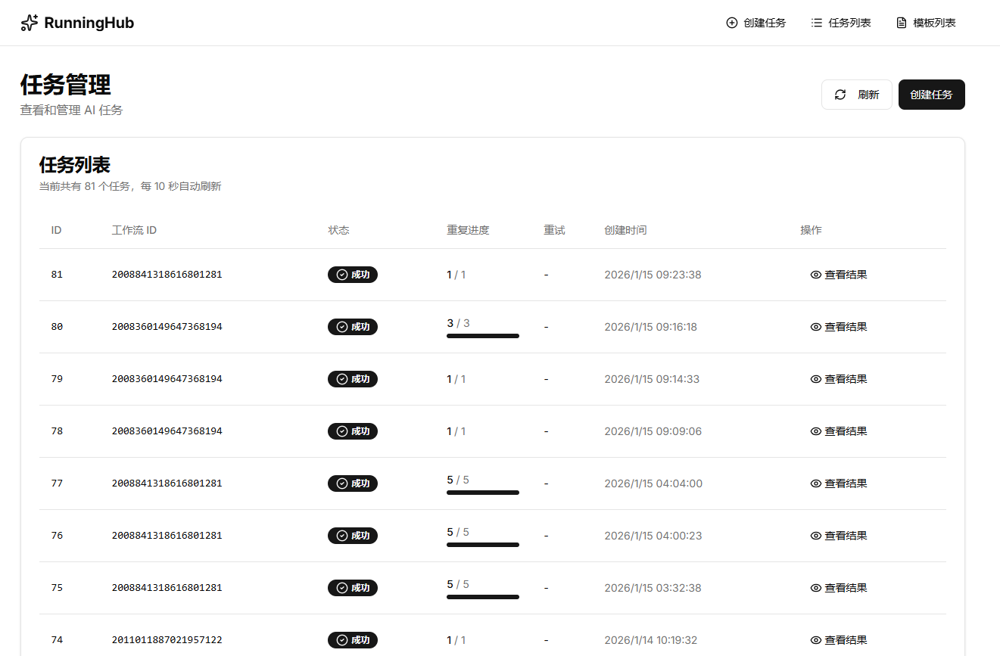
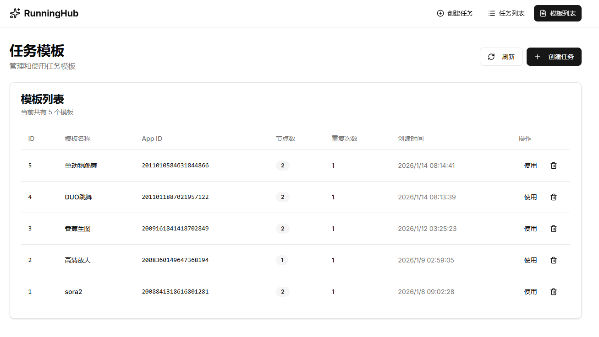

# RunningHub 任务管理系统

一个基于 FastAPI 和 React Router v7 的 AI 任务管理平台，支持批量任务执行、任务模板管理和实时状态监控。

## 功能特性

- **任务管理**
  - 提交 AI 任务到 RunningHub 平台
  - 支持任务重复执行（批量处理）
  - 实时任务状态监控（每 10 秒自动刷新）
  - 任务重试和取消功能
  - 分页查询任务列表

- **文件管理**
  - 本地文件上传
  - 文件去重（基于 SHA256 哈希）
  - 媒体文件预览（图片、视频、音频）
  - 文件使用计数

- **任务模板**
  - 保存常用任务配置为模板
  - 从模板快速创建任务
  - 模板管理（查看、删除）

- **结果查看**
  - 按执行次数分组显示结果
  - 支持多文件结果展示
  - 执行统计（成功/失败次数）
  - 媒体文件在线预览


                                       
                                                                                     
                                      
                                                                                                  
                                     
                                                        
## 技术栈

### 后端
- **框架**: FastAPI 0.125.0
- **数据库**: SQLite
- **任务队列**: 自定义任务管理器（支持并发控制）
- **HTTP 客户端**: requests
- **环境变量**: python-dotenv

### 前端
- **框架**: React Router v7
- **语言**: TypeScript
- **构建工具**: Vite 7
- **UI 框架**: Tailwind CSS 4 + shadcn/ui
- **图标**: lucide-react
- **HTTP 客户端**: axios

## 项目结构

```
runninghub/
├── app.py                # FastAPI 应用主文件
├── database.py           # 数据库操作
├── runninghub.py         # RunningHub API 集成
├── task_manager.py       # 任务队列管理器
├── .env                  # 环境变量配置
├── .env.example          # 环境变量模板
├── pyproject.toml        # Python 项目配置
├── requirements.txt      # Python 依赖
├── static/               # 前端构建输出目录
├── uploads/              # 本地上传文件存储
├── runninghub.db         # SQLite 数据库
└── frontend/             # 前端项目
    ├── app/
    │   ├── routes/      # 页面路由
    │   ├── components/  # UI 组件
    │   ├── lib/         # 工具库
    │   └── types/       # TypeScript 类型定义
    ├── package.json
    └── vite.config.ts   # Vite 构建配置
```

## 快速开始

### 环境要求

- Python 3.13+
- Node.js 18+
- uv 或 pip（Python 包管理器）
- pnpm 或 npm（Node.js 包管理器）

### 1. 克隆项目

```bash
git clone <repository-url>
cd runninghub
```

### 2. 配置环境变量

复制环境变量模板并填入你的 API Key：

```bash
cp .env.example .env
```

编辑 `.env` 文件，填入你的 RunningHub API Key：

```env
RUNNINGHUB_API_KEY=your_api_key_here
```

> 获取 API Key：登录 [RunningHub 控制台](https://www.runninghub.cn) 获取

### 3. 安装后端依赖

**使用 uv（推荐）：**

```bash
uv sync
```

**或使用 pip：**

```bash
pip install -r requirements.txt
```

### 4. 安装前端依赖

```bash
cd frontend
pnpm install
# 或
npm install
```

### 5. 构建前端

```bash
pnpm build
# 或
npm run build
```

构建完成后，前端文件会自动复制到 `static/` 目录。

### 6. 启动后端服务

```bash
python app.py
```

服务将在 `http://localhost:7777` 启动。

### 7. 访问应用

打开浏览器访问：`http://localhost:7777`

## 开发模式

### 前端开发

```bash
cd frontend
pnpm dev
```

前端开发服务器将在 `http://localhost:5173` 启动。

### 后端开发

```bash
python app.py
```

## API 接口

### 任务管理
- `POST /api/task/submit` - 提交任务
- `GET /api/tasks` - 获取任务列表（分页）
- `GET /api/task/{task_id}` - 获取任务详情
- `GET /api/task/{task_id}/results` - 获取任务结果
- `POST /api/task/{task_id}/retry` - 重试失败任务
- `POST /api/task/{task_id}/cancel` - 取消进行中任务

### 应用配置
- `GET /api/app/read/{app_id}` - 获取应用节点配置

### 文件管理
- `POST /api/upload` - 上传文件
- `GET /api/media/files` - 获取媒体文件列表
- `GET /api/media/file/{file_id}` - 获取媒体文件（预览）

### 任务模板
- `POST /api/templates` - 保存模板
- `GET /api/templates` - 获取模板列表
- `GET /api/templates/{template_id}` - 获取模板详情
- `DELETE /api/templates/{template_id}` - 删除模板

## 部署

### 生产环境部署

1. **构建前端**

```bash
cd frontend
pnpm build
```

2. **配置生产环境变量**

创建 `.env.production` 文件：

```env
RUNNINGHUB_API_KEY=your_production_api_key
```

3. **使用 Gunicorn 启动（推荐）**

```bash
pip install gunicorn
gunicorn app:app -w 4 -k uvicorn.workers.UvicornWorker -b 0.0.0.0:7777
```

4. **使用 systemd 服务（Linux）**

创建 `/etc/systemd/system/runninghub.service`：

```ini
[Unit]
Description=RunningHub Task Manager
After=network.target

[Service]
Type=simple
User=www-data
WorkingDirectory=/path/to/runninghub
Environment="PATH=/path/to/runninghub/.venv/bin"
ExecStart=/path/to/runninghub/.venv/bin/gunicorn app:app -w 4 -k uvicorn.workers.UvicornWorker -b 0.0.0.0:7777
Restart=always

[Install]
WantedBy=multi-user.target
```

启动服务：

```bash
sudo systemctl start runninghub
sudo systemctl enable runninghub
```

### Docker 部署（可选）

创建 `Dockerfile`：

```dockerfile
FROM python:3.13-slim

WORKDIR /app

# 安装 Python 依赖
COPY pyproject.toml requirements.txt ./
RUN pip install --no-cache-dir -r requirements.txt

# 复制应用代码
COPY . .

# 构建前端
WORKDIR /app/frontend
RUN npm install && npm run build

WORKDIR /app

# 暴露端口
EXPOSE 7777

# 启动应用
CMD ["python", "app.py"]
```

构建和运行：

```bash
docker build -t runninghub .
docker run -d -p 7777:7777 --env RUNNINGHUB_API_KEY=your_key runninghub
```

## 配置说明

### 任务并发控制

在 `task_manager.py` 中可以修改并发任务数：

```python
MAX_CONCURRENT_TASKS = 2  # 最大并发任务数
```

### 前端 API 地址

在 `frontend/.env` 中配置开发环境 API 地址：

```env
VITE_API_BASE_URL=http://localhost:7777
```

## 常见问题

### 1. 任务执行失败

- 检查 RunningHub API Key 是否正确
- 查看后端日志获取详细错误信息
- 使用"重试"功能重新执行失败的任务

### 2. 文件上传失败

- 检查 `uploads/` 目录是否有写入权限
- 确认文件大小未超过限制
- 查看后端日志

### 3. 前端无法连接后端

- 确认后端服务已启动
- 检查 `VITE_API_BASE_URL` 配置是否正确
- 查看浏览器控制台错误信息

## 许可证

MIT License

## 贡献

欢迎提交 Issue 和 Pull Request！
